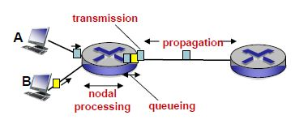

# network

[Computer Networking: A Top-Down Approach (7th Edition)](https://www.amazon.com/Computer-Networking-Top-Down-Approach-7th/dp/0133594149?ref_=Oct_s9_apbd_otopr_hd_bw_byR&pf_rd_r=N3BJ8YAB316G1J3JRCNS&pf_rd_p=d52d9aef-6761-537a-b654-84d5a43406db&pf_rd_s=merchandised-search-10&pf_rd_t=BROWSE&pf_rd_i=3747)
<details>
  <summary>class info</summary>

### scoring

* exam 40, 40 
* hw(problems, review) 10 
* being late up to 4 is fine

### syllabus

* [Application layer protocol](#21-principles-of-network-applications)
* Transport layer protocol

<hr>

* Network layer protocol
* Link, physical layer protocol
* Mobile network

</details>

<hr/>

# notes

## contents

### Chapter 1 Computer Networks and the Internet

* [1.1 what is the Internet?](#11-what-is-the-Internet?)
  + [component](#component)
* [1.2 Network Edge](#12-Network-Edge)
  + [1.2.1 Access Networks](#121-Access-Networks)
  + [1.2.2 Physical Media](#122-Physical-Media)
* [1.3 Network Core](#13-Network-Core)
  + [1.3.1 Two fundamental approaches to moving data](#131-Two-fundamental-approaches-to-moving-data)
  + [1.3.2 A Network of Networks](#132-A-Network-of-Networks)
* [1.4 Evaluation Metrics in networks](#14-Evaluation-Metrics-in-networks)
  + [1.4.1 delay](#141-delay)
  + [1.4.2 loss](#142-loss)
  + [1.4.3 throughput](#143-throughput)
* [1.5 protocol layers, service models](#15-protocol-layers-service-models)
  + [Internet protocol stack](#Internet-protocol-stack)

### Chapter 2 Application Layer

* [2.1 principles of network applications](#21-principles-of-network-applications)
  + [App Structure](#App-Structure)
  + [Socket](#Socket)
  + [Addressing Processes](#Addressing-Processes)
  + [Protocol](#Protocol)
* [2.2 Web and HTTP](#22-Web-and-HTTP)
  + [HTTP response time](#HTTP-response-time)
  + [HTTP format](#HTTP-format)
  + [cookies](#cookies)
  + [how to reduce delay](#how-to-reduce-delay)
* [2.3 Electronic mail](#23-Electronic-mail)
  + [push](#push)
  + [pull](#pull)
* [2.4 DNS](#24-DNS)
  + [DNS services](#DNS-services)
  + [how DNS works ](#how-DNS-works-)
* [2.5 P2P applications](#25-P2P-applications)
  + [Pure P2P architecture](#Pure-P2P-architecture)
  + [File distribution](#File-distribution)
* [2.6 video streaming and content distribution networks](#26-video-streaming-and-content-distribution-networks)
  + [CDN](#CDN)

### Chapter 3 Transport Layer 

* [3.1 transport-layer services](#31-transport-layer-services)
* [3.2 Multiplexing and Demultiplexing](#32-Multiplexing-and-Demultiplexing)
  + [mux and demux](#mux-and-demux)
  + [segment format](#segment-format)
* [3.3 UDP](#33-UDP)
  + [User Datagram Protocol](#User-Datagram-Protocol)
  + [advs of UDP](#advs-of-UDP)
  + [UDP segment format](#UDP-segment-format)
* [3.4 principles of reliable data transfer](#34-principles-of-reliable-data-transfer)
  + [reliable data transfer means..](#reliable-data-transfer-means)
  + [error type](#error-type)
  + [ARQ](#ARQ)
* [3.5 TCP](#35-TCP)
  + [Transmission Control Protocol](#Transmission-Control-Protocol)
  + [TCP segment format](#TCP-segment-format)
  + [reliable data transfer](#reliable-data-transfer)
* [3.6 principles of congestion control](#36-principles-of-congestion-control)
* [3.7 TCP congestion control](#37-TCP-congestion-control)

<hr/>

# 1.1 what is the Internet?

### inter + network

* Network of networks
* connection between networks

ex. mobile network, home networks, institutional networks

## components of the Internet

### H/W

* end hosts: running network apps on terminals
* interconnection devices: router, switch, ...
* links: copper, fiber, radio, wireless...

### S/W

* Operating Software
* application programs
* protocols: rules for communications

<hr/>

# Overview

**network edge**(end host->edge router)---(link)---network core(router->ISP)----**network edge**

* [network edge](#12-network-edge) ⊃ end hosts = end systems ⊃ clients and servers
* [network core](#13-network-core): connects edges ⊃ interconnected devices: routers, switches
* [physical media](#122-physical-media): wired, wireless communication links

# 1.2 Network Edge

## 1.2.1 Access Networks

* end host -> Access Network -> edge router => ISP(Internet Service Provider)
* connects subscribers to a particular service provider and, through the carrier network, to other networks such as the Internet.
* transmission rate: bandwidth ⬆ internet speed ⬆
* (central office) shared / dedicated

### ex1. Digital Subscriber Line

**dedicated** access network 

0. DSL modem -> splitter
1. **DSL phone line**: only one user monopolies this connection
2. (central office) DSL Access Multiplexer
3. voice(~4kHz): telephone network VS data(4kHz~): ISP

### ex2. Cable Network

**shared** access network 

0. cable modem -> splitter
1. **coaxial cable**: cable company provide 1 signal to 多 users
2. (central office) CMTS = Cable Modem Termination System = cable company
3. Hybrid Fiber Coax
4. ISP

### ex3. Home Network

0. (wireless devices -> WAP), wired Ethernet, wired devices
1. router
0. cable or DSL modem, Optical Network Terminal -> splitter
1. **FTTH**(Fiber To The Home)
2. central office or Headend
4. ISP

### ex4. Enterprise / Institutional Network

0. AP
1. Ethernet switch
2. Institutional router
4. **Institutional link**
5. ISP

### ex5. Wireless Access Networks

| my network edge | network core | opponent's network edge |
| ------------- | ------------- |------------- |
| [end host(wireless)---(wireless)---WAP---(wire)---edge router]| (routers) | [edge router -----end host]

* wireless LANs: Wireless Fidelity(shared network)
* wide-area wireless access(shared network)
* Wireless Access Point: a device that creates a wireless local area network. An access point connects to a wired router, switch, or hub via an Ethernet cable, and projects a Wi-Fi signal to a designated area. 

## 1.2.2 Physical Media

: the physical materials that are used to store or transmit information in data communications

* guided media: signals propagate in solid(wired) media
    - Twisted-pair cable: copper wires, behind the ethernet
    - Coaxial cable: copper conductor, broadband
    - Fiber-optic Cable: high speed, low error rate
* unguided media: signals propagate freely(wireless)
    - radio link types

# 1.3 Network Core

* connecting network edges
* the mesh of interconnected routers
* 2 functions of core-network
    - routing: Get a path from source host -> destination host by using routing algorithms
    - forwarding: Move packets from the before router -> the next router by using forwarding table

## 1.3.1 Two fundamental approaches to moving data

### circuit switching VS packet switching 

| circuit switching | packet switching |
| ---------------- | ---------------- |
| physical path | no physical path |
| call setup, resource reservation<br/>(in adv, the entire bandwidth is reserved) | no call setup, no resource reservation |
| how to allocate channel? FrequencyDM, TimeDM | how transmit? store-and-forward transmission |
| all packets use same path | packets travel independently |
| 多 users sharing a link | full link capacity |
| low speed | 3.5x speed but after 35 users.. low QoS(Quality of Service) |
| traditional telephone networks | handling data |

<br/> by Frequency Division Multiplexing , Time Division Multiplexing

#### store-and-forward transmission

app in source Host ----link(by packets)----> app in destination Host

* how? storing bits until becoming a packet and then forwarding it
* => [total time](#delay)

## 1.3.2 A Network of Networks

### hierarchy structure

host < access ISP < regional ISP < IXP < Tier 1 ISP or Content Provider<Br/>


* A content provider(ex. Google) has its own **content provider network** in its own data center
* Internet eXchange Points help create shorter, more direct routes for ISPs and CDNs.

# 1.4 Evaluation Metrics in networks

delay, packet loss, throughput

## 1.4.1 delay

To deliver a packet<Br/>
: (1 HOP) source => nodal processing -> queueing -> transmission -> propagation => destination

* N = no. of packets
* M = no. of hops
* L bits = size of packet
* R bps = bandwidth of the link
* D meters = distance = length of physical link
* A packet/sec = average packet arrival rate 

1. **processing** delay: before forwarding a packet, should check *bits error and destination address* in the packet header
    - d<sub>proc</sub> -> opt to the quality of router
2. **queueing** delay: Time a job waits in a queue until it can be executed 
    - d<sub>queue</sub> -> opt to the number of network users(= traffic intensity = ***La/R***)
        - La/R ≈ 0 -> small / La/R ≈ 1 -> large / La/R > 1 ≈ *infinite* => so variable
3. **transmission**: Time taken to put a packet onto link (link transmission rate = link capacity = link bandwidth)
    - d<sub>trans</sub> = data size / bandwidth = ***L/R sec*** -> opt to bandwidth of output link
4. **propagation**: Time taken to reach the destination from the start point for bits
    - d<sub>prop</sub> = distance / transmission speed = ***D / s***(L/R) -> opt to the amount of data

=> End-To-End ≈ (M + N) * L/R



## 1.4.2 loss

: Packet Loss Rate (<-> Packet Delivery Rate)

* usually in router
* in a buffer when queueing delay, data > queue capacity => dropped
* host: re-transmission, network: waste of resource, user: delay

## 1.4.3 throughput

: sum of traffic <=> how much data has been moved between server and client <Br/>
=> rate: bits/time unit

1. instantaneous: throughput at the peak
2. average: throughput on the average 
    - end-end average throughput == bottleneck link == min(**R<sub>s</sub>, R<sub>c</sub>**, R/10)

# 1.5 protocol layers, service models

## Internet protocol stack

| 5 layers | explanation | protocol | encapsulation | controlled by | how to communicate | 
| ------- | ------- | -----|-----|-----|
| [application](#21-principles-of-network-applications) | support network application | [HTTP](#22-Web-and-HTTP), [SMTP](#23-electronic-mail), [DNS](#24-DNS), FTP | message | user(app developer)| uses [socket](#Socket) API to communicate |
| [**transport**](#31-transport-layer-services) | data transfer process <-> process | TCP, UDP | + segment | OS | logical communication between processes |
| **network** | find path | IP, routing protocols | + datagram |OS|logical communication between hosts|
| **link** | data transfer by hop from source to destination | Ethernet, WiFi | + frame |OS | 
| **physical** | on the wire like cable, radio | bits | Protocol Data Unit |OS | 

* layering: modularization -> maintenance, system update
* encapsulation: message + headers..
    - source -> **switch**(link+physical) -> **router**(network+link+physical) -> destination(only *message + segment* are from source)
    -  always start from physical layer and go up by figuring out the needed info by the headers

# 2.1 principles of network applications

network apps(ex. gmail, youtube, zoom, game) work only on **end systems**

## App Structure

| model | communication | data consumer | data provider | scaling | 
| ---- |---- | ---- | ---- |---- | 
| **client-server model** | process of client <-> process of server | client<br/>on/off<br/>dynamic IP address | server<br/>always on<br/>permanent IP address | data centers↑ | 
| **Peer-2-Peer model** | arbitrary end system <-> arbitrary end system | all devices | all devices | peer↑(self-scalability) | 

## Socket

* A network socket is a set of APIs for *sending and receiving data across the network*.
* like a door: application -> (socket) -> transport -> ...

## Addressing Processes

for http message to web server

### host device -> (permanent 32bit **IP address + port number**(process identifier)) -> host device

* well known port numbers: 80(HTTP), 25(mail)

## Protocol

* [email](#23-electronic-mail): SMTP > TCP
* remote terminal access: Telnet > TCP
* [web](#22-Web-and-HTTP): HTTP > TCP
* file transfer: FTP > TCP
* [DNS](#24-DNS) > UDP

|HTTP|SMTP|
|---|---|
|port|80|25|
|object<->data|pull|push|
|in 1 response message|1 object|多 objects|
|interaction| command(ASCII) + response(status code+phrase)||
|in transport layer|use [TCP](#Internet-transport-protocols-services) connection ∵ reliability||

### application layer protocol 

* open protocols: SMTP, HTTP, FTP, Telnet
* proprietary protocols: skype

#### defines

1. type: request/response message
2. syntax: fields of message
3. semantics: how to interpret fields
4. rules

### underlying transport protocol

#### requirements

| Transport Service | kinds of app | for | 
| ------ |------ |------ |
| **data integrity** | file transfer, web transactions | no loss<Br/>(<-> loss tolerant) |
| **timing** | Internet telephony, interactive games | time sensitive<Br/>(<-> delay) |
| **throughput** | multimedia | minimum throughput<br/>(<-> elastic) | 

#### types

| Transport layer protocols | reliability | speed | occasion |
| ------ |------ |------ | ---- |
| [TCP](#35-TCP) | reliable ∵ in-order delivery| low speed | email, web, file transfer |
| [UDP](#33-UDP) | unreliable ∵ unordered delivery| fast speed | streaming multimedia, internet telephony(one-time transaction) |

* TCP: connection-oriented service by handshaking
    - [error control](#-reliable-data-transfer): ~until no data error
    - [flow control](#flow-control): sender considers receiver's data capability
    - [congestion control](#-37-TCP-congestion-control): no data overload in router/switch

# 2.2 Web and HTTP

<details>
<summary>words</summary>

#### word

* HyperText Transfer Protocol 
* RoundTripTime
* Uniform Resource Locator
* Carriage Return, Line Feed

</details>

## HTTP response time

* www: Webpage > base html file(frame) > objects > url(obj file loc)
* HTTP layers: application: HTTP > transport: TCP > network: IP > link: ethernet, wifi

### non-persistent HTTP 

1. first object
    1. 1RTT for tcp connection request/response: new *TCP connection [socket](#Socket)* created to initiate tcp connection
    2. 1RTT for http request(URL)/response(base HTML file: file transmission time): that socket deleted to *terminate* tcp connection
2. second object: 2RTT + file transmission time

-> **4RTT**+α => long latency<Br/>
-> then... how about **parallel TCP connection**: 4 sockets(< OS) => overhead

### persistent HTTP 

: no tcp connection more after initiated it

1. first object
    1. 1RTT for tcp: two tcp connection sockets created
    2. 1RTT for http: keep two sockets ()
2. second object
    - 1RTT for http: parallel objects request/response

-> **3RTT**+α

## HTTP format

### request

#### request line

: 1 line 

1. method + URL(after hostname) + version + cr + lf
    - ex. GET /100sun/1.md HTTP/1.0\r\n

#### header lines

: 1<= line

1. field name + : + value + cr + lf
    - ex. Host: www.github.com\r\n
    - ex. user-agent, accept-language, keep-alive([how long](#persistent-HTTP))
2. cr + lf (end of header lines)
    - ex. \r\n

#### body

: optional - like POST

* entire body

## cookies

client can keep user session state in cookie file ex. my id in ebay, amazon

1. HTTP request
    - if first access: A server creates ID
    - if not: send my id by each server with cookie headerline
2. HTTP response msg

## how to reduce delay

1. [Increase Access Link Speed](#1.-origin-server-(+-fatter-access-link)): expensive(2s)
2. [Install Local Web Cache](#2.-origin-server-+-local-web-cache): cheaper and faster(1.2s) but need version checking
3. [Conditional GET method](#3.-Conditional-GET)

### 1. origin server (+ fatter access link)

***need to be fixed***

#### assumptions

* data rate from origin servers to browsers = object size * request rate = 0.1 Mbits * 15/s = 1.50Mbps
* ***access link rate***: 1.45Mbps

#### consequences

Utilization

* U<sub>LAN</sub> = data rate / LAN availability = 1.5Mbps / 1Gbps = 15%
* ***U<sub>access link</sub>*** = access link rate / date rate = 1.5Mbps / 1.54Mbps = 99%

#### total delay

* Internet delay = RTT from institutional router to origin servers ≈ 2s
* ***[Access delay](#141-delay)*** = queueing delay = access link rate / date rate = 1.5Mbps / 1.54Mbps ≈ 1 → ∞ ~ ***minutes***
* LAN delay = μs

=> total delay: 2s + ms + μs ≈ >m

(+ increase access link bandwidth)

=> total delay: 2s + ms + μs ≈ >2s

### 2. origin server + local web cache

#### assumptions

cache hit rate: 0.4

#### consequences

* 40% requests satisfied at proxy servers
  + LAN delay = 0.4 * μs 
* 60% requests satisfied at origin servers
  + data rate = 1.5Mbps * 0.6 = 0.9Mbps
  + U<sub>access link</sub> = 99% * 0.6 = 58%
  + Internet delay = 2s * 0.6
  + Access delay ≈ 0 ∵ U<sub>access link</sub> is less than 0.7 -> it's fine
  + LAN delay = μs

=> total delay = 2s * 0.6 + μs * 0.4 ≈ >1.2s

#### proxy server

web caches = proxy server

* what is proxy server?
  + client for origin server
  + server for client
* ex? - HTTP request/response
  + client <-> proxy server <-> origin server
  + if same request: client <-> proxy server
* why web caching? 
  + to reduce overhead of origin server
  + to reduce response time for client
  + to support more users for the origin server
  + to reduce traffic of external server on an institution's access link for local ISP


### 3. Conditional GET

* why? objects in web cache have to be up-to-date as same as the original server
* how? 
  + HTTP request: if-modified-since: $date
  + HTTP response: HTTP/1.0 304 Not Modified || HTTP/1.0 200 OK $data

# 2.3 Electronic mail

### Three major components

* user agents: mail reader program e.g. outlook
* mail servers: gmail, …
* protocols: SMTP, POP3, IMAP, …

=> UA: write -> (SMTP) -> message queue of mail server -> (TCP < SMTP) -> mailbox of mail server -> (POP, IMAP, HTTP) -> UA: read

## push

### SMTP

: delivery/storage to receiver’s server

#### transfer phases

1. *handshaking*(TCP): HELO 
2. *message transfer*
3. *closure*: QUIT, closing connection

## pull

Mail access protocol

### POP3

### IMAP

|POP3|IMAP|
|---|---|
|Post Office Protocol ver3|Internet Access Protocol|
|*download & delete* mode(cannot re-read)<br/>*download & keep* mode(copies on different clients)<br/>=>terminate TCP connection|*keep *all messages in 1 server<br/>=>keep TCP connection|
|*No* mail folder organization|Allows user to organize messages in *folders*|
|*stateless* across sessions|*keep* user state across sessions|

### HTTP

HyperText Transfer Protocol: used in the web-based emails e.g.gmail, hotmail

# 2.4 DNS

Domain Name System

## DNS services

* mapping service: hostname -> (DNS) -> IP address (32 bit)
* host aliasing: alias name(typed URL) -> (DNS) -> canonical name(real URL)
* mail server aliasing
* load distribution: replicated Web servers(many IP addresses correspond to 1 hostname) ∵ scaling

## how DNS works 

* local DNS server) acts like proxy
* DNS hierarchy) Root DNS server: total 13 > Top Level Domain server: com, org, kr(top-level country domains) > authoritative DNS server: amazon.com, google.com > IP address

### by iterated query

: between local DNS server and 1 of DNS hierarchy servers

1. client -> local DNS server -> IP address => client: access to that IP address
2. client -> *local DNS server <-> DNS hierarchy* => client: access to that IP address

### by recursive query

: between at upper level and lower level server

1. client -> local DNS server -> IP address => client: access to that IP address
2. client -> *local DNS server -> DNS hierarchy* => client: access to that IP address

-> heavy load on root => **caching**

* local DNS server caches entries about TLD server
* : client -> *local DNS server -> TLD server -> authoritative DNS server => client: access to that IP address

-> cached entries can be out-of-date => **T**ime**T**o**L**ive when mapping

# 2.5 P2P applications

## Pure P2P architecture

* A peer can be both client and server 
* no need for always-on server
* changing IP addresses
* good scalability
* e.g. [BitTorrent](#BitTorrent), VoIP (Skype) 

## File distribution

how much time to distribute file (size F) from 1 server to N peers?: max{}

* u<sub>s</sub>: server upload capacity
* u<sub>i</sub>: peer i upload capacity
* d<sub>i</sub>: peer i download capacity

### by [app structure](#App-Structure)

||client-server|P2P|
||1 server -> N clients|1 serer -> 1 client, N peers -> N clients(redistribute)|
|upload|**N**F/u<sub>s</sub>|F/u<sub>s</sub>, **N**F/(u<sub>s</sub>+ SUM**u<sub>i</sub>**)|
|download|F/d<sub>min</sub>|F/d<sub>min</sub>|
|graph|steeply linear|steadily curved(assisting the server)|

**varied** ∵ Num of client can be varied

### BitTorrent

#### requesting chunks:

1. file divided into 256Kb chunks
2. asks chunks list to each peer
3. rarest first

#### sending chunks

: tit-for-tat

1. every 30 secs: A peer randomly selects B peer, starts sending chunks to B peer
2. every 10 secs: B peer updates its top 4 providers, starts sending chunks to A peer
3. A peer updates its top 4 providers

# 2.6 video streaming and content distribution networks

how to stream content (selected from millions of videos) to hundreds of thousands of simultaneous users?

1. mega server: doesn't scale
2. [store/serve 多 copies of videos at 多 geographically distributed sites](#CDN)

## CDN

Content Distribution Networks
how does CDN DNS select "good" CDN node to stream to client
-> let client decide

1. give client a list of several CDN servers
2. client picks "best"

### Netflix

1. Netflix uploads studio master to Amazon cloud
2. create 多 version of movie (different endodings) in cloud
3. upload versions from cloud to CDNs(Akami, limelight, level-3 CDN)

1. when client requests(browses) video
2. cloud returns the manifest file addressing three 3rd party CDNs host/stream Netflix content
3. client requests HTTP to 1 of CDN
4. CDN sends streaming 

# 3.1 transport-layer services

### transport-layer VS network-layer

logical communication between...

* processes: p1, p2 <-> p1, p2: transport layer
* hosts: source <-> destination: network layer

### TCP VS UDP 

[here](#types)

# 3.2 Multiplexing and Demultiplexing

## mux and demux

|Multiplexing|Demultiplexing|
|sender|receiver|
|source|destination|
|add transport header|use header info|
|send data from 多 sockets to 1 transport segment|deliver 1 received segment to 多 sockets|

### demux ex

||connetionless demux|connection-oriented demux|
|ex|UDP|TCP|
|to direct segment to appropriate socket|destination IP address<br/>destination port #|source, dest IP address<br/>source, dest port number|
|application<->transport|no handshaking<br/>- 1 app > 1 process > 1 socket|handshaking : making its own socket for 1 specific client<br/>- 1 app > 多 processes(by fork: p4->p5, p6) > 多 sockets<br/>- 1 app > 1 process > 多 threads > 多 sockets|
|transport<->network|1 IP datagram (> IP address) > 1 transport-layer segment (>  port number)||

## segment format

32 bits

* transport header:
    - source port # / dest port #
    - other header fields
* transport payload:
    - application data

# 3.3 UDP

**connectionless** transport

## User Datagram Protocol

* no handshaking = no need for the connection = connectionless
* each UDP segment handled independently of others = delivered out-of-order = can be lost
* unreliable, best speed
* UDP use: streaming multimedia apps, DNS, high-reliability required apps(add reliability at application layer)

## advs of UDP

1. no connection establishment => no delay -> save 1 RTT
2. simple: no need to save connection state at sender, receiver => fast speed
3. only mux and demux services => small header size -> 40% of TCP header
4. no congestion control(resolve data overload in router/switch) => UDP can blast away as fast as desired

## UDP segment format

32 bits

* (8bytes)transport header:
    - (16bits)source port # / (16bits)dest port #
    - (16bits)**length** / (16bits)checksum
* transport payload:
    - application data

length = 8 bytes + length of payload 

# 3.4 principles of reliable data transfer

## reliable data transfer means..

there could be error under the network layer but *transport layer* makes *app layer* to feel that there is *no error*

## error type

sender <-> receiver

### 1. bit error

: can be resolved by ***checksum***

* no error) receiver sends *ACK*nowledgement to the received packet to notice the result of bit error to sender
* error) discard the packet and timeout() so that the sender *retransmits*

#### how to make checksum

sender

1. all the segment data / 16bit
2. add the first two 16-bit data
3. wraparound it and get sum (add the first digit to the last digit)
    - iterate until the end of data
4. 1's complement of the total sum
5. => checksum

receiver

1. all the segment data / 16bit
2. add the first two 16-bit data
3. wraparound it and get sum (add the first digit to the last digit)
    - iterate until the end of data
4. add checksum filed to the total sum
5. => result == 1111...111 -> no error

but if it gets errors from both 1 and 0 -> there is no way to check error

### 2. packet loss

: can be resolved by ***timeout + sequence number*** => [ARQ](#ARQ)

## ARQ

Automatic Repeat reQuest: **an error-control method for data transmission** that uses ***acknowledgements*** (messages sent by the receiver *indicating* that it has *correctly received a packet*) and ***timeouts*** (specified periods of time *allowed to elapse* before an acknowledgment is to be received) to achieve **reliable data transmission** over an unreliable communication channel. 

1. sender adds the *sequence number* to the packet: pkt0
2. the *sender waits* "reasonable" amount of *time for ACK(timeout)*: ack0
3. * packet loss / ACK loss => *retransmits* pkt0
    - premature timeout or delayed ACK => *deny* the request

=> +) *ordered delivery* / *data duplication prevention* when ACK loss

### Utilization of Sender

fraction of time sender is busy sending 

``` md
U<sub>sender</sub>
= N* (sender's job / total time)<Br/>
= N * {D<sub>trans</sub>) / (**2*D<sub>prop</sub> + D<sub>trans</sub>**)}<br/>
= N * {D<sub>trans</sub>) / (1 RTT + D<sub>trans</sub>)}<br/>
= N * 0.027%
```

1. stop-and-wait: 1 data packet at a time 
2. pipelining method: N data packets at a time => U<sub>sender</sub> ⬆

### pipelined protocols

||go-back-N|selective repeat|
|---|---|---|
|sender sends|all the packets in its window|
|sender window|N, **already ack'ed** < sent, not yet ack'ed < usable, not yet sent < not usable|N, **already ack'ed** *<->* sent, not yet ack'ed <  not usable|
|sender sets timer for|the first packet|each unpacked packets|
|timeout(x)|retransmit N<Br/>: packet x and *all higher* seq # packets in window|retransmit 1<Br/>: for each unack'ed packets|
|---|---|---|
|receiver sends|*only cumulative ACK*|*individual ACK*|
|receiver window|1|N, **transmitted to app layers** < not yet received(loss) <-> *buffered, but already ack'ed* < acceptable|
|Supported order at Receiving end|in-order delivery only<br/>:discard all the higher packets and go back to the last cumulative ACK and send it again|out of deliver as well<br/>:send ACK of it but also buffer packets for all the higher packets to deliver together to app layer|

#### window

* windows are moved when **..**, move the window after #
* window size↑ throughput↑ num of packets to retransmit↑ 
* window size ∝ network congestion, receiver buffer overflow
* *sequence # >= 2 * window size* ∵ duplicate data accepted as new if all the packets in windows size are lost.

# 3.5 TCP

## Transmission Control Protocol

* point-to-point: one sender, one receiver( <=> multicasting protocol)
* connection-oriented service = need handshaking
* Pipelined transmission(-> throughput↑ ): MSS(maximum segment size)
* Full-duplex connection: bi-directional data flow <=> both a and b can be either sender or receiver

## TCP segment format

* (dynamic)transport header:
    - (16bit)source port # / (16bit)dest port #
    - (32bits)Seq. #
    - (32bits)ACK. #
    - (32bits)**header len** + flags(U A P R S F) + rwnd
    - (32bits)checksum + urg data pointer
    - options...
* transport payload:
    - application data

### Sequence #

* unit: bytes
* from sender to receiver
* the first byte in segment's data = n

### Acknowledgements #

* unit: bytes
* from receiver to sender
1. flag Ack bit == 0: ignore ACK
2. flag Ack bit == 1: ack # = seq # of the next byte expected from the other side = n + MSS

### rwnd

* unit: bytes
* rwnd guarantees receiver buffer won't overflow 
    - => sender manages the amount of original sending window to receiver's rwnd value
* rcv buffer = buffered data + free buffer space(rwnd)

#### flow control

receiver controls sender not to overflow receiver's buffer 

### flags

* unit: bits
* URGent data: generally not used
* ACKnowledgement: to ignore ACK at first
* PuSH data now: generally not used
* ReSeT, SYNchronization: to establish connection
    - RST: to rest the connection
    - SYN: to hand-shake, it means the first packet from sender
* FINale: to close a connection, it means the last packet from sender

#### 3-way handshake

The handshake confirms the identities of the connecting systems and allows additional communication to take place.

### ex. general

* seq # = the last received ACK #
* ack # = the last received seq # + size of data(< MSS)

* A's initial seq# is x(451)
* B's initial seq# is y(103)
* MSS = 512

``` md
A -> B : seq# 451, ack# 103, data 512 bytes, SYN=1, ACK=0 : handshaking 1
B -> A : seq# 103, ack# 963, data 512 bytes, SYN=1, ACK=1 : handshaking 2
A -> B : seq# 963, ack# 615, data 512 bytes, SYN=0, ACK=1 : handshaking 3, **EST** finished, no more handshaking
B -> A : seq# 615, ack# 1475, data 154 bytes
A -> B : seq# 1475, ack# 1629, data 1 byte, FIN=1, ACK=1
**FIN_WAIT_1**
B -> A : seq# 1629, ack# 1476, data 1 byte, FIN=1, ACK=1
**FIN_WAIT_2**
after got both FIN bit from hosts, **TIME_WAIT** to get the last ACK bit
A -> B : no seq#, ack# 1478, no data, ACK=1 : 
**closed** connection
```

* A transmits 1111 bytes to B
* B transmits 666 bytes to A

### ex. echo program

* Error-free
* Assume connection already established

``` 
B. Seq=78, ACK=42, data = 'B'
A. Seq=42, ACK=79, data = 'C' (user sends 'C')
B. Seq=79, ACK=43, data = 'C' (host ACKs receipt of 'C' / echoes back 'C')
A. Seq=43, ACK=80 (host ACKs receipt of echoed 'C')
```

## reliable data transfer

[click](#34-principles-of-reliable-data-transfer)

* cumulative ACKs (of go-back-N) + buffering packet (of selective repeat)
* retransmissions triggered by timeout events + duplicate ACKs

### sender

1. data from app layer -> segments
2. segment + seq. #
3. (re)send segment and set timer
    - even when timeout(n), if received the cumulative ACK which is higher than the lost ACK, then it doesn't retransmit
    - when sender reciept of 3 duplicat ACK, then **fast retransmit** before timeout

### receiver

1. receive data from sender
2. [bit error check](#-1-bit-error)
3. send ACK
    1. received in-order seq. #  -> cumulative ACK
    2. received gapped seq. #  -> buffered all the higher pkts and go back to the last cumulative ACK and send it again 
    3. received duplicated seq. # -> discard that packet but send its cumulative  ACK tho
        * lost ACK, premature timeout

### timeout

TimeoutInterval = EstimatedRTT + safety margin

* SampleRTT = the latest RTT value
* EstimatedRTT = avg of cumulative RTT values = (1-α) * EstimatedRTT + α * SampleRTT = 0.9 * EstimatedRTT + 0.1 * SampleRTT

# 3.6 principles of congestion control

# 3.7 TCP congestion control
cwnd
