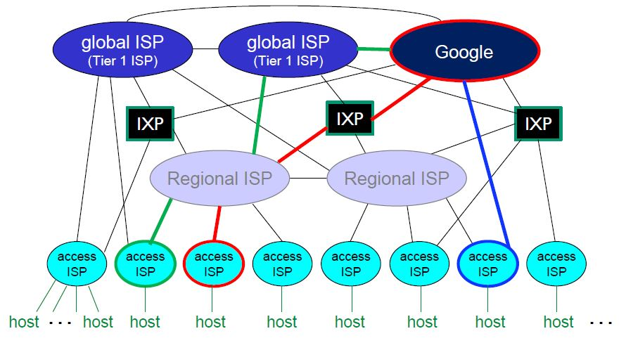
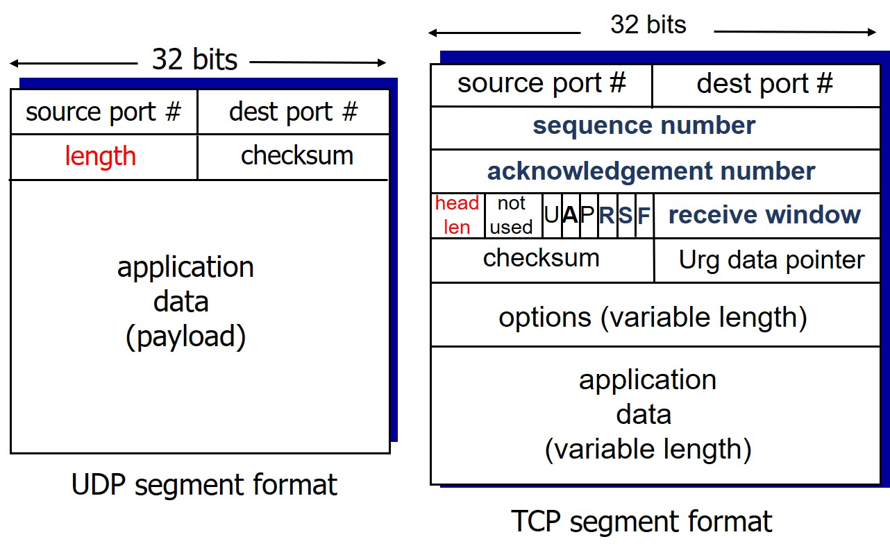

[Computer Networking: A Top-Down Approach (7th Edition)](https://www.amazon.com/Computer-Networking-Top-Down-Approach-7th/dp/0133594149?ref_=Oct_s9_apbd_otopr_hd_bw_byR&pf_rd_r=N3BJ8YAB316G1J3JRCNS&pf_rd_p=d52d9aef-6761-537a-b654-84d5a43406db&pf_rd_s=merchandised-search-10&pf_rd_t=BROWSE&pf_rd_i=3747)

##### Chp 1 Computer Networks and the Internet

# Contents

### [Chp 1 Computer Networks and the Internet](#chp-1-computer-networks-and-the-internet-1)

* [1.1 what is the Internet?](#11-what-is-the-internet)
* [1.2 Network Edge](#12-network-edge)
* [1.3 Network Core](#13-network-core)
* [1.4 Evaluation Metrics in networks](#14-evaluation-metrics-in-networks)
* [1.5 protocol layers, service models](#15-protocol-layers-service-models)

### [Chp 2 Application Layer](#chp-2-application-layer-1)

* [2.1 principles of network applications](#21-principles-of-network-applications)
* [2.2 Web and HTTP](#22-web-and-http)
* [2.3 Electronic mail](#23-electronic-mail)
* [2.4 DNS](#24-dns)
* [2.6 video streaming and content distribution networks](#26-video-streaming-and-content-distribution-networks)

### [Chp 3 Transport Layer](#chp-3-transport-layer-1)

* [3.1 transport-layer VS network-layer](#31-transport-layer-vs-network-layer)
* [3.2 transport-layer services](#32-transport-layer-services)
* [3.3 transport-layer protocol](#33-transport-layer-protocol)
* [3.4 transport-layer segment](#34-transport-layer-segment)
* [3.5 principles of reliable data transfer](#35-principles-of-reliable-data-transfer)

<hr/>

# 1.1 what is the Internet?

### inter + network

* Network of networks
* connection between networks

ex. mobile network, home networks, institutional networks

## components of the Internet

### H/W

* end hosts: running network apps on terminals
* interconnection devices: router, switch, ...
* links: copper, fiber, radio, wireless...

### S/W

* Operating Software
* application programs
* protocols: rules for communications

<hr/>

# Overview

**network edge**(end host->edge router)---(link)---**network core**(router->ISP)----**network edge**

* [network edge](#12-network-edge) ⊃ end **hosts = end systems** ⊃ clients and servers
* [network core](#13-network-core): connects edges ⊃ interconnected devices: **routers, switches**
* [physical media](#122-physical-media): wired, wireless communication **links**

# 1.2 Network Edge

## Access Networks

* **end host -> Access Network -> edge router** => ISP(Internet Service Provider)
* connects subscribers to **a particular service provider** and, through the carrier network, to other networks such as the Internet.
* bandwidth ⬆ internet speed ⬆
* (central office) **shared / dedicated**

### ex1. Digital Subscriber Line

**dedicated** access network 

0. DSL modem -> splitter
1. **DSL phone line**: only one user monopolies this connection
    - voice(~4kHz) VS data(4kHz~)
2. (central office) DSL Access Multiplexer
3. voice->telephone network VS data->ISP

### ex2. Cable Network

**shared** access network 

0. cable modem -> splitter
1. **coaxial cable**: cable company provide 1 signal to 多 users
    - how? by **FDM**(Frequency Division Multiplexing) : divide the broadband with multiple **channels** (video-cnn, ... & data)
2. (central office) CMTS = Cable Modem Termination System = cable company
3. HFS(Hybrid Fiber Coax)
4. ISP

### ex3. Home Network

0. wired devices, (wireless devices ->) WAP, wired Ethernet => router
0. cable or DSL modem, Optical Network Terminal -> splitter
1. **FTTH**(Fiber To The Home)
2. central office or Headend
4. ISP
* Wireless Access Point: a device that creates a wireless Local Area Network. An access point connects to a wired router, switch, or hub via an Ethernet cable, and projects a Wi-Fi signal to a designated area. 

### ex4. Enterprise / Institutional Network

0. AP, institutional mail and web servers => Ethernet switch
1. (gateway) Institutional router
4. **Institutional link**
5.  ISP

### ex5. Wireless Access Networks

| my network edge | network core | opponent's network edge |
| ------------- | ------------- |------------- |
| [end host(wireless)---(**wireless**)---WAP---(wire)---edge router]| (routers) | [edge router -----end host]

* shared network
1. WiFi(Wireless Fidelity):**wireless LANs** within the building(coverage:35m)
2. cellular network(3G,4G(LTE),5G): **wide-area wireless access** provided by cellular operator(coverage:Nkm)


## Physical Media

the physical materials that are used to store or transmit information in data communications

* **guided** media: signals propagate in solid(**wired**) media
    - **TP**(twisted-pair) **cable**: two insulated copper wires
      - behind the ethernet
    - **Coaxial cable**: insulated copper conductor
      - provide broadband but too heavy to use now...
    - **Fiber-optic Cable**: glass fiber transmitting pulse
      - high speed, low error rate => good for electromagnetic noise
* **unguided** media: signals propagate freely(**wireless**) by electromagnetic wave
    - radio link types: WiFi, cellular, satellite, terrestrial microwave...

# 1.3 Network Core

* connecting network edges by access network by link
* the mesh of interconnected routers
* 2 functions of network core
    1. **routing**: Get a path from source host -> destination host by using routing algorithms
    2. **forwarding**: Move packets from the before router -> the next router by using forwarding table

## Two fundamental approaches to moving data

### circuit switching VS packet switching 

| circuit switching | packet switching |
| ------------------------ | ---------------- |
| **physical path** | no physical path |
| **call setup**, resource reservation<br/>(in adv, the entire bandwidth is **reserved**) | no call setup, no resource reservation |
| how to allocate channel? <br/>**FrequencyDM, TimeDM** | how transmit?<br/> **store-and-forward transmission**: storing(waiting) bits of packets in the router until becoming a packet && signal and then forwarding it to the next router |
| all packets use same path | packets travel independently |
| 多 users sharing a link | **full link capacity** in the time of ***[end-end delay](#delay)*** |
| **low speed**, only 10 users | 3.5x speed but after 35 users.. **low QoS**(Quality of Service) |
| traditional telephone networks | handling data |

## A Network of Networks

### ISP hierarchy structure

**host < access ISP < regional ISP < IXP < Tier 1 ISP or Content Provider**
<Br/>


* Internet eXchange Points & peering link: connects between competitor ISPs
* Tier 1 commercial ISP e.g. AT&T: national & global coverage
* **Content** Provider e.g. Google: private network that connects its own data center

# 1.4 Evaluation Metrics in networks

delay, packet loss, throughput

## delay

Delay taken to deliver a packet in the route of "source => **nodal processing -> queueing -> transmission -> propagation** => destination"

* N = no. of packets
* M = no. of hops
* a packet/sec = average packet arrival rate 
* L bits = size of packet (< MTU)
* R bps = **link transmission rate = link capacity = link bandwidth**
* d meters = distance = length of physical link
* s = signal speed


1. **processing** delay: Time taken to check **bits error and destination address** in the packet header before forwarding a packet
    - d<sub>proc</sub> -> opt to the quality of **router**
2. **queueing** delay: Time a job **waits** in a queue of router until it can be executed 
    - d<sub>queue</sub> ∝ **traffic intensity** = I = La/R : so variable -> opt to #. network **users**
        - I ≈ 0 -> avg d<sub>queue</sub> = small
        - I ≈ 1 -> avg d<sub>queue</sub> = large
        - I > 1 ≈ avg d<sub>queue</sub> = *infinite*
3. **transmission** delay: Time needed to transmit packets **into link** 
    - d<sub>trans</sub> = ***L/R*** -> opt to link **transmission rate**
4. **propagation** delay: Time taken to **reach the destination** from the start point for bits
    - d<sub>prop</sub> = ***d/s*** -> opt to the amount of **data**
* => ***End-To-End delay ≈ (M + N) * L/R***

## loss

* How many packets are lost in transmission = **PLR**(Packet Loss Rate) (<-> PDR(Packet Delivery Rate))
* In **queueing delay**, *arrived packets when data > queue-capacity in a buffer* -> dropped(**loss**) => host: re-transmission / network: waste of resource / user: feel delay

## throughput

* how much traffic that link can transmit between sender <-> receiver = throughput (bits/sec) 
  + **instantaneous**: throughput at the peak
  + **average**: throughput on the average 
* throughput ∝ ***bottleneck*** link == ***min(R<sub>s</sub>, R<sub>c</sub>, R/#. connection)***
  + usually the network core(R) is built not to be the bottleneck.

# 1.5 protocol layers, service models

## 5 layers

* why **layering**? modularization => maintenance 👍, system update 👍 in complex system

| | explanation | protocol | Protocol Data Unit for encapsulation | controlled by |
| ------- | ------- | -----|-----|-----|
| [application](#chp-2-application-layer-1) | support network application | HTTP, SMTP, DNS, FTP | message | app developer| 
| [**transport**](#chp-3-transport-layer-1) | data transfer ***between processes*** | TCP, UDP | + segment | **OS** |
| **network** | **Router** finds path ***between hosts*** | IP, routing protocols | + datagram |OS|
| **link** | **Switch** transfers data between hosts | Ethernet, WiFi | + frame |OS|
| **physical** | Hubs defines means to transmit bits data on the wire like cable, radio |||OS|


##### Chp 2 Application Layer

# 2.1 principles of network applications

network apps(ex. gmail, game, youtube, zoom, [netflix](#netflix)) work only on **end systems** not on network core devices

## network app. structure

| model | data consumer | data provider | for scaling | e.g.|
| ---- |---- | ---- | ---- | ----|
| **client-server model** | **client**<br/>: should be **always on**<br/>: has a **permanent** IP address | server<br/>: can be on/off<br/>: has a dynamic IP address | servers↑data centers↑ | |
| **PeerToPeer model** | all the arbitrary end systems: can be **on/off**<br/>: has a **dynamic** IP address || peer↑(**self-scalability**) | file distribution(BitTorrent) , VoIP (Skype) |

* peer = end systems which work equally in equal protocol layer

### File distribution 

* file size F
* N: variable #. client 
* u<sub>s</sub>: upload capacity of server 
* u<sub>i</sub>: upload capacity of peer i
* d<sub>i</sub>: download capacity of peer i 
  + d<sub>min</sub>: the lowest download capacity between peers 

||client-server|P2P|
|--|--|--|
||1 server -> N clients|1 server -> 1 client & N peers -> N peers(redistribute)|
|(server)time to send N copies|NF/u<sub>s</sub>|F/u<sub>s</sub> & NF/(u<sub>s</sub>+ ∑u<sub>i</sub>)|
|(client)time to download copies|F/d<sub>min</sub>|F/d<sub>min</sub>|
|=> time to distribute file to clients|**D<sub>c-s</sub>≥max{NF/u<sub>s</sub>, F/d<sub>min</sub>}**|**D<sub>p-p</sub>≥max{NF/(F/u<sub>s</sub>, u<sub>s</sub>+ ∑u<sub>i</sub>, F/d<sub>min</sub>}**|
|(graph)Distribution-time/N|steeply linear|steadily curved|

#### P2P: BitTorrent 

torrent: peer group send&receive chunks

* client
  1. file divided into 256Kb **chunks**
  2. get peer list from server
  3. requesting chunks 
    1. asks **chunks list** to each peer
    2. ask **rarest chunks** first
* server: sending chunks: **tit-for-tat**
  1. every 30 secs: **A** peer **randomly selects** B peer, starts sending chunks to B peer
  2. every 10 secs: **B** peer **updates** its **top 4 providers**, starts sending chunks to A peer
  3. **A** peer **updates** its **top 4 providers**

## application layer protocol 

* open protocols: SMTP, HTTP, FTP, Telnet
* proprietary protocols: skype

### defines

[in details...](#format)

1. type: *request/response* message
2. syntax: fields of *message*
3. semantics: how to *interpret* fields
4. rules

## ex

### protocols by occasion 

|description|app. proto|trans. proto|
|--|--|--|
|[web](#22-Web-and-HTTP)|HTTP|TCP(reliable)|
|[email](#23-electronic-mail)|SMTP, POP3, IMAP, HTTP|TCP(reliable)|
|remote terminal access|Telnet|TCP(reliable)|
|file transfer|FTP|TCP(reliable)|
|[Domain Name System](#24-DNS)|DNS|UDP(fast speed), TCP|
|[video streaming](#26-video-streaming-and-content-distribution-networks)|RTP, HTTP|UDP(fast speed), TCP|

### required transport services by occasion 

|ex|data integrity|timing|throughput|
| ------ |------ |------ | ---- |
|web, email, file transfer|*no loss*|delay ok|elastic|
|streaming multimedia(video/audio/games), internet telephony(one-time transaction) |*loss-tolerant*|time-sensitive|minimum throughput guarantee|

# 2.2 Web and HTTP

* www: Webpage > base html file(=frame) > objects > url(=loc of obj file)
* HTTP layers: HTTP > TCP > IP > ethernet, WiFi
* HyperText Transfer Protocol 
* Uniform Resource Locator = hostname + pathname

## HTTP response time

### non-persistent HTTP 

#### parallel objects request/response

1. first object = 2RTT + α
    1. new TCP connection socket is *created* to initiate tcp connection
      - 1RTT for tcp connection request/response 
    2. the socket deleted to *terminate* tcp connection
      - 1RTT + file transmission time for http request(⊃URL) + response(⊃base HTML file)
2. second object = 2RTT + α
    1. 1RTT for tcp
    2. 1RTT + α for http

* **4RTT**+α => long latency
* need parallel TCP connections <- 4 sockets(∈ OS) needed => overhead for OS

### persistent HTTP 

#### parallel objects request/response

1. first object = 2RTT + α
    1. 1RTT for tcp: two tcp connection sockets created
    2. 1RTT for http: keep two sockets
2. second object = 1RTT + α
    1. 1RTT + α for http

* **3RTT**+α
* need only 1 TCP connection <- 1 sockets(∈ OS) needed => no overhead for OS

## cookies

client can get recommendations, keep user session state(shopping cart, log-on) in **cookie file (∋ cookie header line ∋ user-id** e.g. amazon id, ebay id)

1. HTTP request w/ cookie file
2. HTTP response msg
  + if first access: provides set-cookie=$id (creates ID entry in the backend db)
  + else: provides cookie-specific action

<details>
<summary>HTTP message format</summary>

HTTP request message 

* (1 line)request line: method + URL(after hostname) + version + cr + lf
      - ex. GET /100sun/1.md HTTP/1.0\r\n
* (1<= line)header lines 
  1. field name + : + value + cr + lf
      - ex. Host: www.github.com\r\n
      - ex. user-agent, accept-language, keep-alive([how long](#persistent-HTTP))
  2. cr + lf (end of header lines)
      - ex. \r\n
* body: optional - like POST

</details>

## Web Caches: reduce delay

* how to reduce delay?
  1. [Increase Access Link Speed](#1.-origin-server-(+-fatter-access-link)): expensive(2s)
  2. [Install Local Web Cache](#2.-origin-server-+-local-web-cache): cheaper and faster(1.2s) but need version checking

### 1. origin server + fatter access link

***access link rate ↑ U<sub>access link</sub> ↓ total delay ↓***

#### total delay

presented

* 1Gbps LAN
* data object size = 0.1Mbits
* data request rate = 15/s
* RTT from institutional router to origin servers = 2s

assumptions

* data rate = data object size * data request rate = 0.1 * 15 = 1.5Mbps
* ***access link rate***: 1.54Mbps ***=> 154Mps***

consequences

* U<sub>LAN</sub> = data rate / LAN availability = 1.5Mbps / 1Gbps = 0.15%
* ***U<sub>access link</sub>*** = access link rate / date rate = 1.5Mbps / 1.54Mbps = 99% ***=> 0.99%***

delays

* Internet delay ≈ RTT = 2s
* ***Access delay*** = [queueing delay](#141-delay) = access link rate / date rate = 1.5Mbps / 1.54Mbps ≈ 1 → ∞ ~ minutes ***=> msecs***
* LAN delay = μs

=> total delay: 2s + ***m*** + μs ≈ >m ***(+ increase access link rate)*** => total delay: 2s + ***msecs*** + μs ≈ >2s

 

### 2. origin server + local web cache

#### total delay

assumptions 

* cache hit rate: 0.4

consequences

* 40% requests satisfied at proxy servers
  + LAN delay = **μs * 0.4**
* 60% requests satisfied at origin servers
  + data rate = 1.5Mbps * 0.6 = 0.9Mbps
  + U<sub>access link</sub> = 99% * 0.6 = 58%
  + Internet delay = **2s * 0.6**
  + Access delay ≈ 0 ∵ U<sub>access link</sub> is less than 0.7 -> it's fine
  + LAN delay = μs

=> total delay = 2s * 0.6 + μs * 0.4 ≈ **1.2s**

#### web caches 

web caches = proxy server

* what is proxy server?
  + client for origin server && server for client
* ex? - HTTP request/response
  + originally) client <-> proxy server <-> origin server
  + if same request) client <-> proxy server
* why web caching? 
  + to reduce response time for client
  + to reduce overhead for origin server
  + to support more users for origin server
  + to increase utilization of access link for local ISP
* **Conditional GET method**
  + why? objects in web cache have to be **up-to-date** as same as the original server
  + how? 
    - HTTP request ∋ last update date of caches
    - HTTP response ∋ whether cache is up-to-date + data

# 2.3 Electronic mail

* **User Agents**: mail reader program e.g. outlook
* **mail servers**: gmail, … ⊃ 1 message queue, N user mailboxes
* **protocols**: SMTP, POP3, IMAP, …

=> **UA: write -> (SMTP) -> message queue** of mail server **->** (TCP < **SMTP) -> mailbox** of mail server **-> (POP, IMAP, HTTP) -> UA: read**

## push: SMTP

Simple Mail Transfer Protocol: delivery to receiver’s server

* direct transfer
* **handshaking**(TCP connection first) **-> message transfer -> closure**

|SMTP|HTTP|
|---|---|
|port **2**5**|port 80**|
|user -> **push** data -> server|server -> **pull** object -> user|
|**多 objects** in meesage w/ 多 protocols|1 object in message|
|**ASCII command**(phrase)**-response**(status-code+phrase) **interaction**||
|use **TCP connection** ∵ reliability||

## pull: POP3, IMAP, HTTP

mail access protocol

|POP3|IMAP|
|---|---|
|Post Office Protocol ver3|Internet Access Protocol|
|1. **download & delete** mode(retrieve PC 外 X read)<br/>2. **download & keep** mode(copies on different clients=>read ok on N clients)|keep all messages in 1 server(=>synchronization)|
|after downloading, **terminate TCP connection**|after downloading, **keep** TCP connection|
|**No** mail folder organization|Allows user to organize messages in **folders**|
|**stateless** across sessions|**keep** user state across sessions|

* HTTP: used in the web-based emails to pull webpages objects e.g. gmail, hotmail

# 2.4 DNS

Domain Name System

## DNS services

* **mapping service**: hostname -> (DNS) -> IP address (32 bit)
* **host aliasing**: alias name(typed URL) -> (DNS) -> canonical name(real URL)
* **mail server** aliasing: provide mail server of specific domain
* **load distribution**: replicated Web servers(many IP addresses correspond to 1 hostname)
  + (<->no centralized DNS ∵ single point of failure, traffic volume, distant centralized db, no scaling) 

## DNS servers

1. **local DNS server** ≒ default name servers ≒ proxy servers ⊃ **mapping service**
2. **DNS hierarchy ⊃ root, TLD, authoritative**
    1. Root DNS server: total 13
    2. TLD(Top Level Domain) server: com, org, top-level country domains(kr)
    3. authoritative DNS server: amazon.com, google.com(hostname) ⊃ **mapping service**(IP address)

### by iterated query

: between local DNS server and each DNS hierarchy servers

* client -> **local <=> root -> TLD -> authoritative** => client: access to that IP address

-> heavy load on local DNS server

### by recursive query

: between at upper level and lower level server

* client -> **local => root -> TLD -> authoritative** => client: access to that IP address

-> heavy load on root DNS server => **caching**

### by caching

: Local DNS server caches entries about TLD server

* client -> **local => TLD -> authoritative** => client: access to that IP address
  + Cached entries can be out-of-date => mapping entries ⊃ **T**ime**T**o**L**ive entries

# 2.6 video streaming and content distribution networks

* video traffic >= 50% of downstream residential ISP traffic
* then how to stream video content to thousands of simultaneous users?

1. mega server: doesn't **scale**, **heterogeneity**(capability diff)
2. store/serve 多 copies of videos at 多 geographically distributed sites => **CDN**

## Content Distribution Networks

how does CDN DNS select "good" CDN node to stream to client? let client decide

1. give client a list of several CDN servers
2. client picks "best"

### Netflix

#### uploading

1. Netflix uploads studio master to Amazon cloud
2. **create 多 versions** of movie (different endodings) in **cloud**
3. **upload copies** of 多 versions from cloud to **CDNs**(Akami, limelight, level-3 CDN)

#### streaming

1. when client **requests**(browses) video
2. **cloud** returns the manifest file **addressing** three 3rd party **CDNs** host/stream Netflix content
3. client sends **HTTP** to 1 of **CDN**
4. CDN sends **streaming**

##### Chp 3 Transport Layer

# 3.1 transport-layer VS network-layer

logical communication between...

* **transport** layer between **processes**: p1, p2 <-> p1, p2
* **network** layer between **hosts**: source <-> destination
* 1 IP datagram (∋ **IP address**) > 1 transport-layer segment (∋ **port#**)

# 3.2 transport-layer services

## Socket

* a set of APIs.
* Processes send & receive Messages from app. via Socket. 
  + like a door: application -> (socket) -> transport -> ...
* after generating socket by client, **OS allocate host-local port#**
* **1 client > 1 socket**

## Multiplexing and Demultiplexing

* **mux**: at sender, from socket to **segment**, by **add**ing port# to transport header
* **demux**: at receiver, from segment to **appropriate socket**, **detect**ing path by IP address + port#

# 3.3 transport-layer protocol

### TCP VS UDP

|Transmission Control Protocol|User Datagram Protocol|
|---|---|
|**connection-oriented, handshaking**|connectionless, no handshaking|
|**reliable**, in-order delivery|each UDP segment handled independently -> **unordered delivery, can be lost** => unreliable |
|**error control**: ~until no data error(checksum, ARQ)<br/>**flow control**: sender considers receiver's data capability(rwnd)|no connection establishment -> no need to save connection state<br/> => no delay, **fast speed**|
|congestion control| **no congestion control** => no data overload in router/switch|
|for demux, require IP address, port# of **dest**<br/>&nbsp; why? **1 app** > 1 process > **1 socket**<br/>&nbsp; |for demux, require IP address, port# of **source + dest** <br/>&nbsp; why? - **1 app** > 多 processes(by fork) > **多 sockets**<br/>&nbsp; &nbsp; &nbsp; &nbsp; &nbsp; - **1 app** > 1 process > 多 threads > **多 sockets**|
|web, email, file transfer|streaming multimedia apps, DNS, high-reliability required apps<br/>(∵ add reliability at app. layer)|

# 3.4 transport-layer segment



## UDP segment format

* only mux and demux services => **small header size** ≈ 40% of TCP header
* (16bit)length = header length(=4*16bits=8bytes) + payload length 

## TCP segment format

* (32bit)sender adds **seq#**(=the current seq#=n)
* (32bit)receiver adds cumulative **ack#**(=the next expected seq#=**n + MSS**)
* (16bit)length = header length : variable

### flow control

#### (16bit)receiver window

* receiver adds rwnd size(os autoadjust)
  + rwnd guarantees that receiver buffer won't overflow 
  + rcv buffer = buffered data + **free buffer space**(=rwnd)

#### (6bits)flags

* ACK: to check validity of ACK#, ACK==0 means ignore ACK# (∵ first packet)
* ReSeT, SYNchronization: to establish tcp connection(handsha ke)
  + SYN: SYN==1 means the first packet from sender
* FINale: to close tcp connection, FIN==1 means the last packet from sender

### 3-way handshake

#### ex. echo program

* Error-free
* Assume connection already established

``` 

B. Seq=78, ACK=42, data = 'B'
A. Seq=42, ACK=79, data = 'C' (user sends 'C')
B. Seq=79, ACK=43, data = 'C' (host ACKs receipt of 'C' / echoes back 'C')
A. Seq=43, ACK=80 (host ACKs receipt of echoed 'C')
```

#### ex. general

* seq # = the last received ACK #
* ack # = the last received seq # + size of data(< MSS)
* A's initial seq# is x(451)
* B's initial seq# is y(103)
* MSS = 512

``` md
A -> B : seq# 451, no ack#, data 512 bytes, *SYN=1*, *ACK=0*, FIN=0 : handshaking 1
B -> A : seq# 103, ack# 963, data 512 bytes, *SYN=1*, ACK=1, FIN=0 : handshaking 2
A -> B : seq# 963, ack# 615, data 512 bytes, SYN=0, ACK=1, FIN=0 : handshaking 3
============**EST** finished, no more handshaking===============
B -> A : seq# 615, ack# 1475, data 154 bytes, SYN=0, ACK=1, FIN=0
A -> B : seq# 1475, ack# 1629, data 1 byte, SYN=0, ACK=1, *FIN=1*
===============**FIN_WAIT_1**===============
B -> A : seq# 1629, ack# 1476, data 1 byte, SYN=0, ACK=1, *FIN=1* 
===============**FIN_WAIT_2**===============
===============**TIMED_WAIT** to get the last ACK bit, after got both FIN bits===============
A -> B : no seq#, ack# 1478, no data, SYN=0, ACK=1, FIN=1
===============**closed** connection===============
```

* A transmits 1111 bytes to B
* B transmits 666 bytes to A

# 3.5 principles of reliable data transfer

## reliable data transfer means..

* there could be error under the network layer but *transport layer* makes *app layer* to feel that there is *no error*
* so let's resolve any occasion that can occur error
  1. Receiver received packet, but it's wrong data. => **bit error**
  2. packet loss, ACK loss, premature timeout, delayed ACK => **packet loss**

## 1. bit error <- checksum

### how to detect bit error

1. sender calc checksum and put it in the checksum field
2. receiver calc checksum and compare it with the checksum field
  + receiver's total sum + sender's checksum field
    - result == 1111...111 -> they're same: **no error => send ACK**nowledgement
    - error => not send ACK
    - c.f. but if it gets errors from both 1 and 0 -> there is no way to check error

### how to make checksum


1. all the segment data / 16bit
2. sum all the 16bits if sum>=16bit: wraparound
3. until the end of data
4. checksum = 1's complement of total sum

## 2. packet loss <- ARQ 

### Automatic Repeat reQest 

= packet retransmission method

* **timeout**: after periods of time allowed to elapse to wait ACK for sender
* **sequence number**
  + => **ordered delivery**: sender adds the seq# to the packet 
  + => **data duplication prevention**: receiver can detect when sender retransmitted packet

### ARQ performance

* L = 1KB, R = 1Gbps, D<sub>prop</sub> = 15ms

> U<sub>sender</sub><br/>
> = N* (time just for sending / total time)<Br />
> = N * {D<sub>trans</sub> / 1 RTT + D<sub>trans</sub>)}<br />
> = N * {(L/R) / (2*D<sub>prop</sub> + L/R)}<br />
> = N * 0.027%

### ARQ methods

1. stop-and-wait method: 1 data packet at a time => U<sub>sender</sub> = 0.027%
  + duplicate packet: discard it and send its ACK again
2. **pipelining** method: **N** data packets at a time using window => U<sub>sender</sub> = N * 0.027% => **throughput↑** 
  + duplicate packet: not exist

#### pipelined protocols

||go-back-N|selective repeat|
|---|---|---|
|senders sends| unack'ed packets up to N in order | unack'ed packets up to N out of order(=> receiver buffer make order) |
|sender sets timer for|the **first** unack'ed packet|**each** unack'ed packets|
|sender timeout(x)|retransmit **N**<Br/>: packets whose seq# >= x in window|retransmit **1**<Br/>: for each unack'ed packets|
|receiver sends|**only cumulative ACK** == 1(no window) |**all individual ACK** == N(==[rwnd](#tcp-segment-format))|
|after packet loss|**discard** all the packets and **go back** to the last cumulative ACK and send it again|**buffer** all the packets|

* sender can send N packets up to windows size N without receiving its before ACK
* sendBase = windows are moved after seq#. of ack'ed when received ACK
* window size↑ throughput↑ packets#. to retransmit↑ 
* window size ∝ network congestion, receiver buffer overflow
* **sequence # >= 2 * window size** ∵ when all the packets in the size of window are lost, duplicate data will be accepted as new. 

## TCP reliable data transfer

* point-to-point: one sender, one receiver( <=> multi-casting protocol)
* Full-duplex connection: bi-directional data flow <=> both a and b can be either sender or receiver

### Pipelined transmission

* (go-back-N) cumulative ACKs 
* (selective repeat) buffering packet 

### fast retransmissions

when sender receives **triple duplicate** accumulative **ACK**(ack# 100), even **before timeout**, **retransmit** the packet(seq# 100)

### TCP timeout

* **TimeoutInterval = EstimatedRTT + safety margin**
* EstimatedRTT = avg of cumulative RTT values = 0.9 * EstimatedRTT + 0.1 * SampleRTT
  + why? when retransmission(didn't receive ACK), throughput↓ timeout⇑ SampleRTT(=the latest RTT value)⇑
